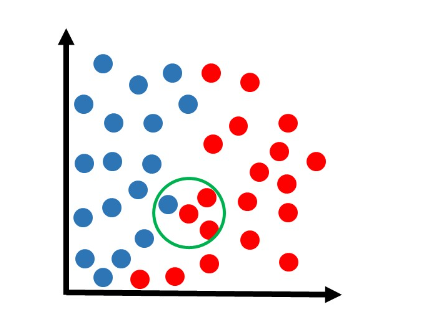

## Modelo KNN (K Nearest Neighbors)

O KNN (K-nearest neighbors, ou “K-vizinhos mais próximos”) costuma ser um dos primeiros algoritmos aprendidos por iniciantes no mundo do aprendizado de máquina.

O KNN é muito utilizado em problemas de classificação, e felizmente é um dos algoritmos de machine learning mais fáceis de se compreender.

Para entender como o KNN funciona detalhadamente, primeiro considere que temos um conjunto de dados dividido em duas classes: azul e vermelho, conforme a figura abaixo.

Agora recebemos uma amostra que ainda não está classificada, e gostaríamos de definir se ela pertence à classe azul ou à classe vermelha. Digamos que essa nova amostra (cor verde na figura abaixo) esteja localizada nessa região:

Observa-se a classe dos vizinhos mais próximos, em uma votação onde a maioria vence. Por exemplo, vamos supor que estamos analisando os 3 vizinhos mais próximos. Obs: mais próximo significa com a menor distância em relação à amostra:

Na figura acima, podemos ver que os 3 vizinhos mais próximos pertencem à classe vermelha. Então como houve 3 votos a zero para a classe vermelha, essa amostra fica sendo classificada nessa classe:

Obs: talvez agora esteja mais claro o significado do nome “KNN”, que refere-se a “k-vizinhos mais próximos”, onde k é um número que podemos determinar. Nesse exemplo, estamos usando k=3.

Agora recebemos outra amostra que queremos classificar:

Utilizando o mesmo método KNN com k=3:

Encontramos os 3 vizinhos mais próximos dessa amostra. Dessa vez, há duas amostras da classe vermelha e uma da classe azul. Como a votação ficou 2×1 para a classe vermelha, essa amostra ficaria sendo classificada nessa classe:

Essa metodologia poderia ser aplicada para qualquer nova amostra e estaríamos aptos a definir sua devida classificação. Porém até agora utilizamos apenas o exemplo de k=3. Na prática, podemos escolher outro valor de k.

Vamos supor que a mesma amostra anterior estivesse sendo analisada com o algoritmo de KNN com k=5:

Dessa vez, dos 5 vizinhos mais próximos, 3 são azuis e 2 são vermelhos. Portanto a classe vencedora foi a azul. Essa amostra seria classificada nessa classe:

#### Nota-se que, dependendo do valor de k, poderemos ter resultados diferentes para cada situação.

Fonte: https://didatica.tech/o-que-e-e-como-funciona-o-algoritmo-knn/ 
