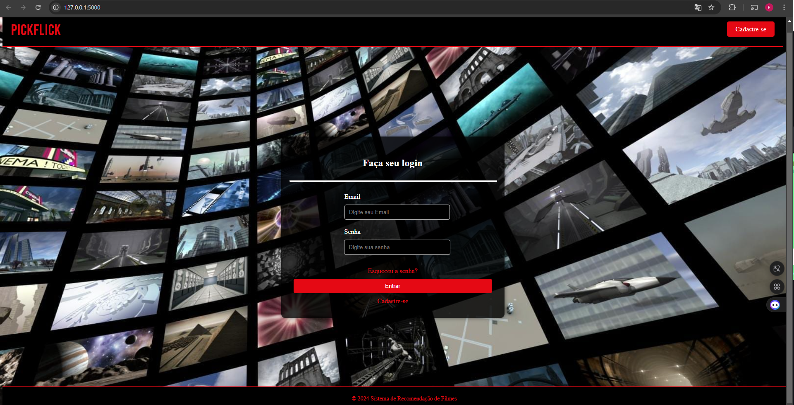
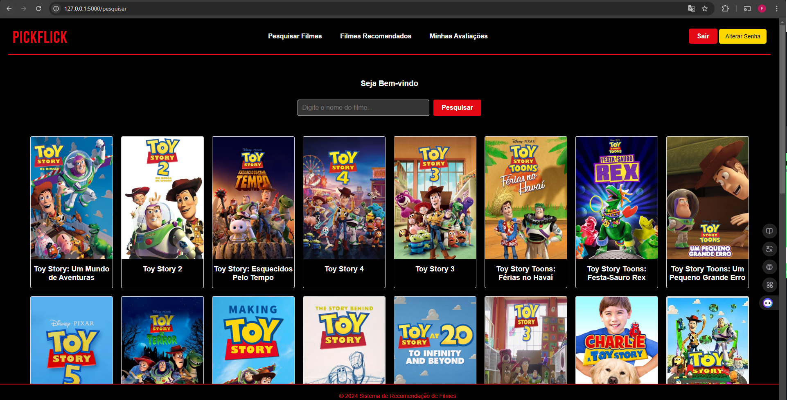
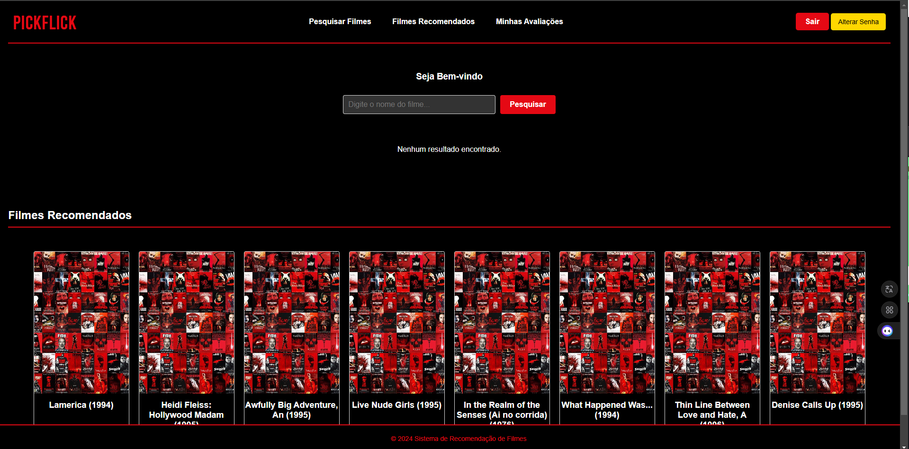
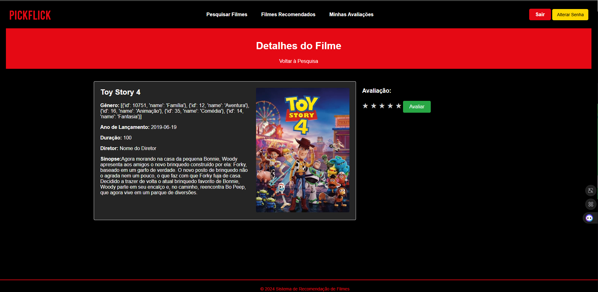

# PickFlick 🎥

A personalized movie recommendation system built with Flask and MySQL, powered by machine learning algorithms. PickFlick offers an engaging platform where users can search, rate, and discover movies tailored to their preferences.

## Features 🌟

Personalized Recommendations: Uses collaborative and content-based filtering to suggest movies.

Dynamic Movie Cards: Displays interactive cards with movie details, including hover effects.

User Authentication: Secure login and registration with a user-friendly modal interface.

Movie Ratings: Users can rate and review movies to enhance recommendation accuracy.

Modern UI: Styled with CSS for a sleek and responsive design.pp

### Screenshots 📸
Login Page

Movie Search and Dynamic Cards

Recommendation Page

Rating Modal

Installation and Setup ⚙️
Clone the repository:

bash
Copy code
git clone https://github.com/fabriciotaveira1/pickflick-python-flask/
cd pickflick  
Set up the virtual environment and install dependencies:

bash
Copy code
python3 -m venv env  
source env/bin/activate  # On Windows: .\env\Scripts\activate  
pip install -r requirements.txt  
Configure the database:

Create a MySQL database named pickflick.
Update the config.py file with your database credentials.
Run the application:

bash
Copy code
flask run  
Open your browser and visit http://127.0.0.1:5000.

Technologies Used 💻
Backend: Flask, MySQL
Frontend: HTML, Tailwind CSS
Machine Learning: Scikit-learn for filtering algorithms
Contributing 🤝
Fork the repository
Create your feature branch: git checkout -b feature-name
Commit your changes: git commit -m 'Add some feature'
Push to the branch: git push origin feature-name
Open a pull request
